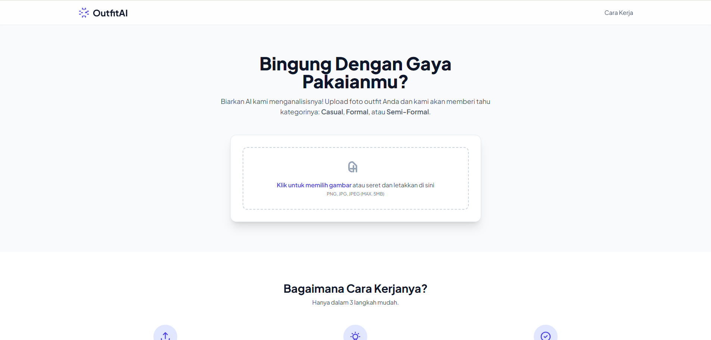

# OutfitAI: AI-Powered Fashion Style Classifier



OutfitAI is a web-based application that leverages a deep learning model to classify fashion styles from user-uploaded images. The system categorizes clothing outfits into three distinct styles: **Casual**, **Formal**, and **Semi-Formal**, providing users with instant feedback on their attire.

This project demonstrates a complete end-to-end machine learning workflow, from data preprocessing and model training to deploying a functional web service with Flask.

## ✨ Features

-   **AI-Based Classification**: Utilizes a fine-tuned ResNet50 model to analyze and predict fashion styles.
-   **Interactive Web Interface**: A clean and user-friendly UI built with HTML and styled with Tailwind CSS.
-   **Real-time Predictions**: Users receive immediate classification results upon uploading an image.
-   **Image Preview**: Allows users to see the image they have selected before submitting it for analysis.
-   **Confidence Score**: Displays the model's confidence level for each prediction in a clear, visual format.

## 🛠️ Tech Stack

-   **Backend**: Python, Flask
-   **Machine Learning**: TensorFlow, Keras, Scikit-learn, NumPy
-   **Frontend**: HTML, Tailwind CSS
-   **Image Processing**: Pillow
-   **Version Control**: Git & Git LFS (for large model file handling)

## 🚀 Getting Started

Follow these instructions to set up and run the project on your local machine.

### Prerequisites

-   Python 3.10
-   Git and Git LFS installed on your system.

### Installation & Setup

1.  **Clone the repository:**
    ```bash
    git clone [https://github.com/rchljr/OutfitAI.git](https://github.com/rchljr/OutfitAI.git)
    cd OutfitAI
    ```

2.  **Create and activate a virtual environment:**
    ```bash
    # For Windows
    py -m venv .venv
    .\.venv\Scripts\Activate.ps1

    # For macOS / Linux
    python3 -m venv .venv
    source .venv/bin/activate
    ```

3.  **Install the required dependencies:**
    The project's dependencies are listed in `requirements.txt`.
    ```bash
    pip install -r requirements.txt
    ```

4.  **Download the model file:**
    This project uses Git LFS to handle the large model file. Ensure Git LFS is installed, then pull the file.
    ```bash
    git lfs pull
    ```
    This will download the `fashion_classifier_improved.h5` file.

### Running the Application

1.  **Start the Flask server:**
    ```bash
    flask run
    ```

2.  **Access the application:**
    Open your web browser and navigate to `http://127.0.0.1:5000`. You can now upload an image to test the classifier.

## 📈 Model Performance & Future Work

The current model achieves a validation accuracy of **44%**. A detailed analysis reveals that this performance is primarily constrained by the nature of the dataset rather than a fundamental flaw in the model architecture.

**Key Challenges Identified:**
-   **High Class Ambiguity**: The visual distinction between "Casual," "Formal," and especially "**Semi-Formal**" is highly subjective and overlapping. The model struggles most with the semi-formal category, often confusing it with the other two, as confirmed by the confusion matrix.
-   **Data Variance**: The dataset contains significant variations in lighting, background noise, and model poses, which makes it challenging for the model to isolate relevant clothing features.

**Planned Improvements (Future Work):**
1.  **Data-Centric Approach**:
    -   **Data Cleaning**: Manually curate the dataset to remove the most ambiguous or low-quality images.
    -   **Advanced Augmentation**: Implement more robust data augmentation techniques to better simulate real-world conditions.
2.  **Model-Centric Approach**:
    -   **Architecture Experimentation**: Test other pre-trained models like `EfficientNetV2` or `MobileNetV2` which might be better suited for this specific task.
    -   **Hyperparameter Tuning**: Further optimize the learning rate, dropout values, and the number of fine-tuned layers.
3.  **Problem Simplification**:
    -   As a baseline, the problem could be simplified to a binary classification (e.g., Casual vs. Formal) to achieve a higher initial accuracy before re-introducing the more complex semi-formal class.

This project serves as a strong foundation, and these identified next steps provide a clear roadmap for significant performance enhancement.
